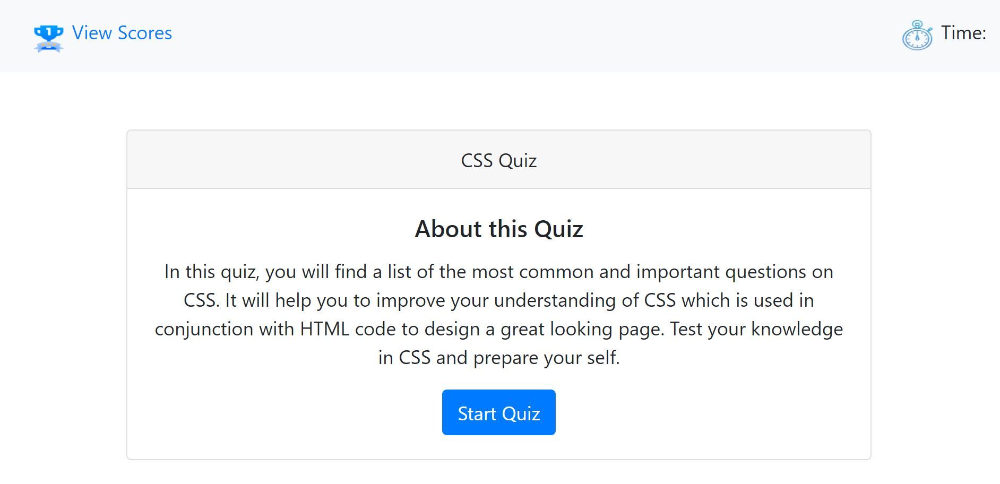
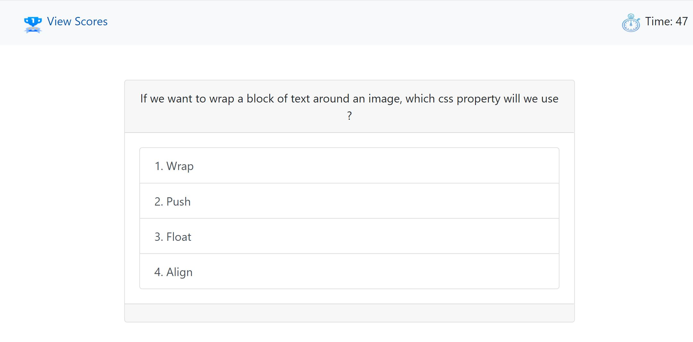
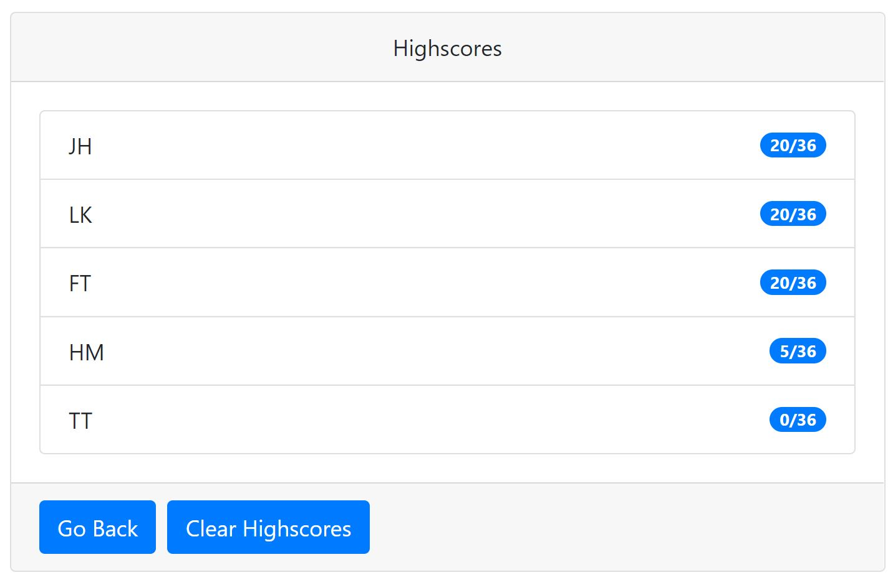
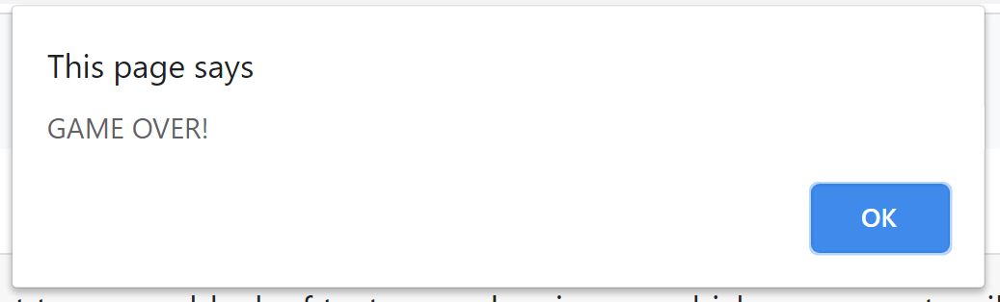

# Homework04 - Web APIs: Code Quiz

This project is about the creation of a quiz webpage from the scratch . With the use of Javascript as the principal programming language and thanks to the potent front-end CSS framework as Bootstrap, I've been able to build this incredible CSS Quiz's webpage which is also responsive to all screen size including mobiles.

[Click here to Access CSS Quiz](https://chernanma.github.io/Code-Quiz/)

---

## Criteria used to develop this project

- GIVEN a User is taking a CSS quiz
- WHEN User click on the  button
- THEN the timer starts and the question is presented
- WHEN User answer a question
- THEN a "Correct" or "Wrong" message will appears momentarily on the bottom of the card where the next question is presented. 
- WHEN User answer a question incorrectly
- THEN time is subtracted from the clock and the user does not get any point for it.
- WHEN all questions are answered or the timer reaches 0
- THEN an alert pops up notifying Time out! the game is over
- WHEN the game is over
- THEN a credential card is presented so the user can enter his/her initial to save his/her final score.

NOTE: The score is calculated base on the number of questions and the correct/incorrect answer. After the user has answered all questions and the initials and the  button has been clicked. The score and initials will be saved in the local storage and the user will be redirected to the Highscores webpage where all the previous scores have been storaged.

Once user has been redirected to the Highscores webpage, the user will have the obtion to GO BACK or CLEAR the score table.

---
## Screenshots

### Main Page

### Question page

### Highscore page

### Alert when Game is over

